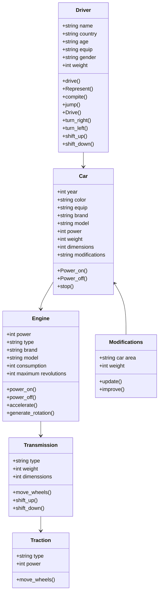
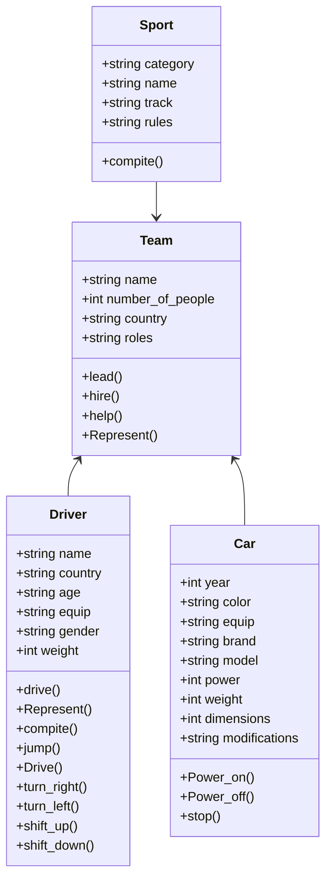

# Reto-2
### Case: Sport Cars

Here, we have all the classes for this topic 

   ```mermaid
          classDiagram
          direction TB
   
      
          class Car {
      	    +int year
      	    +string color
              +string equip
              +string brand
              +string model
              +int power
              +int weight
              +int dimensions
              +string modifications
      	    +Power_on()
      	    +Power_off()
              +stop()
              
          }
           class Sport {
              +string category
              +string name
              +string track
              +string rules
              
              +compite()
      
      
          }
         
          class Driver {
              +string name
              +string country
              +string age
              +string equip
              +string gender
              +int weight 
              
              
              +drive()
              +Represent()
              +compite()
              +jump()
              +Drive()
              +turn_right()
              +turn_left()
              +shift_up()
              +shift_down()
              
      
          }
           class Team {
            +string name
            +int number_of_people
            +string country
            +string roles

            +lead()
            +hire()
            +help()
            +Represent()
            }

           class Engine {
      	    +int power
              +string type 
              +string brand
              +string model 
              +int consumption
              +int maximum revolutions
      
      	    +power_on()
              +power_off()
              +accelerate()
              +generate_rotation()
          }
      
          class Producer-brand {
      	    +string name
              +string country
              +string founder
              +int year_foundation
      
      	    +Produce()
              +Represent()
          }
      
      
          class Modifications {
              +string car area
              +int weight
      
              +update()
              +improve()
      
          }
      
          class Transmission {
              +string type
              +int weight 
              +int dimenssions
      
              +move_wheels()
              +shift_up()
              +shift_down()
          }
          
         
      
          class Traction {
              +string type
              +int power
              
              +move_wheels()
      
              
          }

         
```
### Relation about driver-car


### Realation about Team 


### Relation Car and other parts
  ```mermaid
        classDiagram
        direction TB
           
        
            class Car {
        	    +int year
        	    +string color
                +string equip
                +string brand
                +string model
                +int power
                +int weight
                +int dimensions
                +string modifications
        	    +Power_on()
        	    +Power_off()
                +stop()
                
            }
        
            class Engine {
        	    +int power
                +string type 
                +string brand
                +string model 
                +int consumption
                +int maximum revolutions
        
        	    +power_on()
                +power_off()
                +accelerate()
                +generate_rotation()
                +move_car()
            }
        
            class Producer-brand {
        	    +string name
                +string country
                +string founder
                +int year_foundation
        
        	    +Produce()
                +Represent()
            }
        
           
        
            
        
            class Modifications {
                +string car area
                +int weight
        
                +update()
                +improve()
        
            }
        
            class Transmission {
                +string type
                +int weight 
                +int dimenssions
        
                +move_wheels()
                +shift_up()
                +shift_down()
            }
            
            
            class Traction {
                +string type
                +int power
                
                +move_wheels()
        
                
            } 
            
            
            Car <-- Engine
            Producer-brand--> Car 
            Car<-- Modifications
            Car<-- Transmission
            Car<-- Traction
  ```
 


